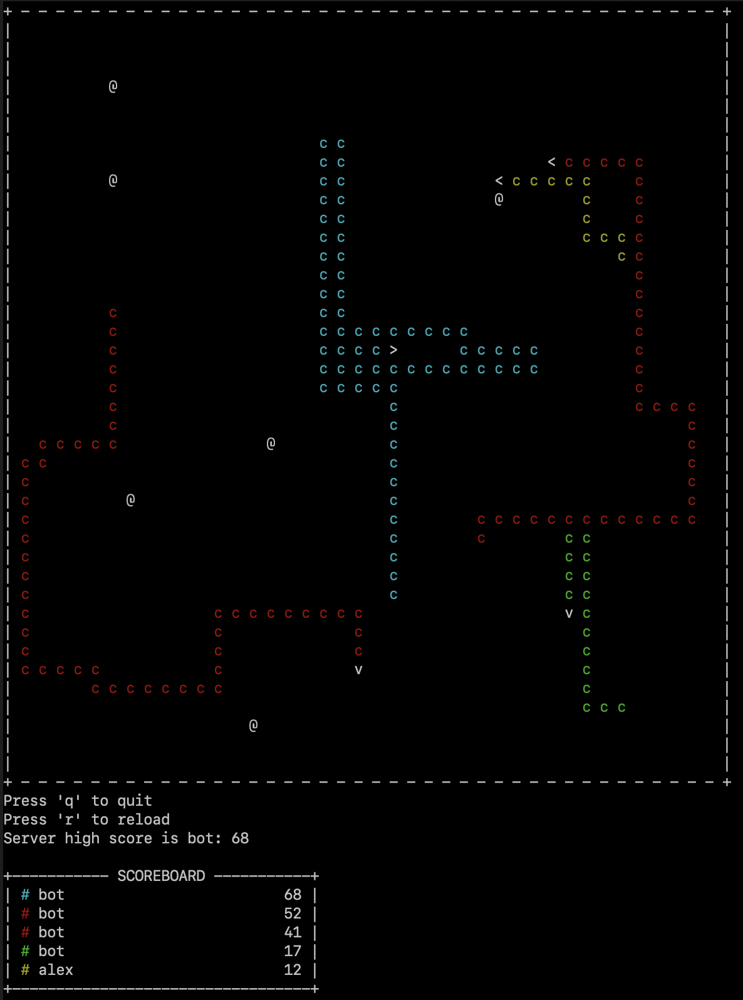
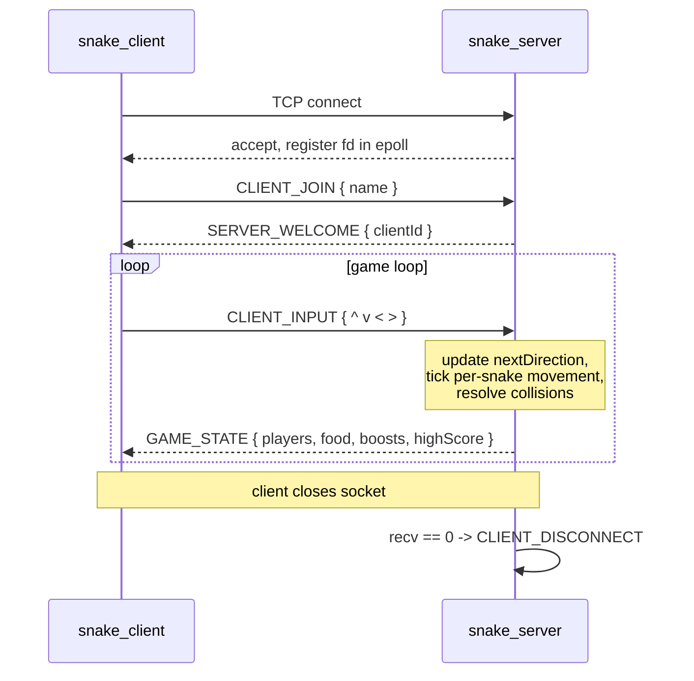

# SnakeMultiplayer

A terminal-based, real-time multiplayer Snake game written in C++20, built on a custom TCP wire protocol and a non-blocking `epoll` server. 

Built as a way to explore low-latency trading systems concepts. Also, it's fun to play.

Eat `@` to grow your snake and increase your score. Eat `*` for a speed boost. Avoid the walls and other snakes.

## Components

- **`snake_server`** - game server. Owns the arena, advances the simulation, broadcasts game state.
- **`snake_client`** - `ncurses` TUI. Captures keystrokes, renders the latest server snapshot.
- **`snake_bot`** - headless client that runs snake bots which path to food via Dijkstra's algorithm.

## Networking & engine architecture

- **Single-threaded event loop** on the server, driven by Linux `epoll` (level-triggered) over non-blocking TCP sockets - accept, recv and send all multiplex through one fd table with no threads or locks.
- **State-change-driven broadcasts**: the server only emits `GAME_STATE` when input or movement actually changes the game state, minimising idle cycles.
- **Per-snake movement clocks** instead of a fixed global tick each `Player` carries its own `nextMoveTime` and `movementFrequencyMs`, so speed boosts simply shorten that interval without being coupled to the engine cadence.
- **Reverse-Dijkstra pathing**: `BotNetwork` builds a distance field from every food source over the arena graph (snake bodies are obstacles), then walks to the neighbour with the smallest distance - O(W·H) per tick.

## Protocol

- **Newline-delimited JSON over TCP**, serialised via `nlohmann::json`. Every `ProtocolMessage` carries a `MessageType`, a `clientId`, and a free-form `message` payload.
- **Explicit TCP framing**: TCP is a byte stream, so each fd has a per-connection rolling buffer that's drained on every `'\n'` boundary. Partial messages and coalesced packets are handled by the parser.
- **Symmetric on both sides**: the same `ProtocolMessage` struct and `toString` / `fromString` pair live in a header-only `common/` library, so client, server and bot all dispatch on a single `switch` over `MessageType`.
- **`clientId`-based addressing**: the server hands out an integer `clientId` on `SERVER_WELCOME` and routes everything by it; the underlying socket fd stays an implementation detail of `NetworkServer`.

## Message exchange

## Future development Ideas

- **Custom binary wire format**: migrate from newline-delimited JSON to a length-prefixed binary protocol with fixed-layout message headers, to cut bandwidth and parse cost.
- **Different transport protocols for different message types**: keep player connections, joins and inputs on TCP (lossiness not okay), but use UDP multicast for `GAME_STATE` - trading reliability for lower latency on the high-volume path.
- **Snapshot + incremental updates**: stop broadcasting the full game state every tick. Emit deltas with a periodic full snapshot for new joiners and gap recovery (eg market data dissemination).
- **Deterministic replay from sequenced messages**: assign a monotonic sequence number to every `CLIENT_INPUT` and persist them to a log - replaying the same byte stream into a fresh engine reproduces the exact game state.
