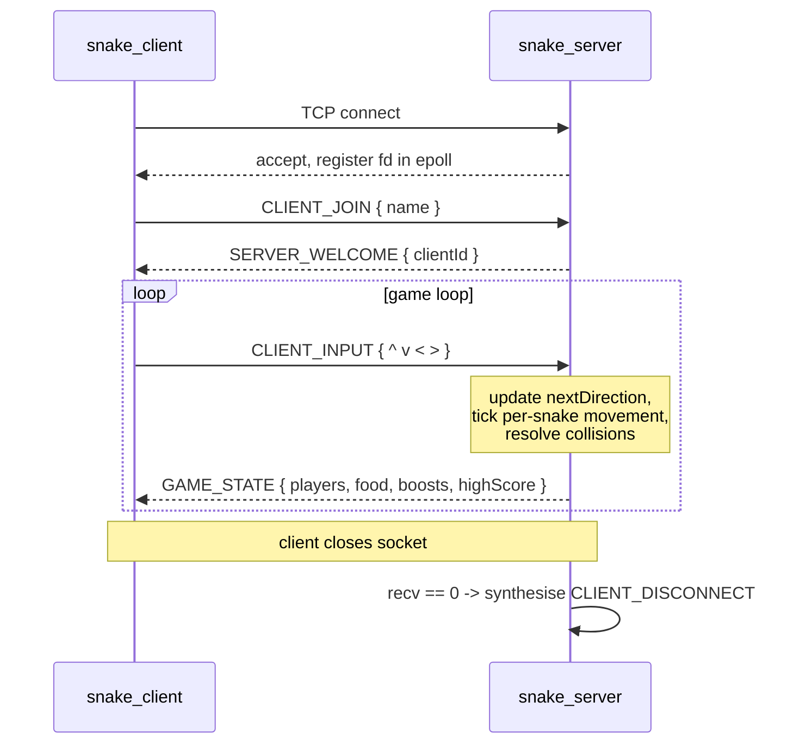

# SnakeMultiplayer

A terminal-based, real-time multiplayer Snake game written in C++20, built on a custom TCP wire protocol and a non-blocking `epoll` server.

Eat `@` to grow your snake and increase your score. Eat `*` for a speed boost. Avoid the walls and other snakes.

## Components

- **`snake_server`** — game server. Owns the arena, advances the simulation, broadcasts game state.
- **`snake_client`** — `ncurses` TUI. Captures keystrokes, renders the latest server snapshot.
- **`snake_bot`** — headless client that runs an AI-controlled snake from a single process, each pathing to food via Dijkstra's algorithm.

## Screenshot

## Networking & engine architecture

- **Single-threaded event loop** on the server, driven by Linux `epoll` (level-triggered) over non-blocking TCP sockets — accept, recv and send all multiplex through one fd table, no threads or locks.
- **Per-snake movement clocks** instead of a fixed global tick: each `Player` carries its own `nextMoveTime` and `movementFrequencyMs`, so speed boosts simply shorten that interval without disturbing the engine cadence.
- **State-change-driven broadcasts**: the server only emits `GAME_STATE` when input or movement actually changes the game state, keeping idle bandwidth at zero.
- **One process, many bots**: `BotNetwork` wraps a pool of `NetworkClient` connections under its own internal `epoll`, so a single binary can drive dozens of concurrent bots against the live server.
- **Reverse-Dijkstra pathing**: the bot builds a distance field from every food source over the arena graph (snake bodies are obstacles), then walks the neighbour with the smallest distance — O(W·H) per tick.

## Protocol

- **Newline-delimited JSON over TCP**, serialised via `nlohmann::json`. Every `ProtocolMessage` carries a `MessageType`, a `clientId`, and a free-form `message` payload.
- **Explicit framing**: TCP is a byte stream, so each fd has a per-connection rolling buffer that's drained on every `'\n'` boundary — partial messages and coalesced packets both fall out of the same parser.
- **Symmetric on both sides**: the same `ProtocolMessage` struct and `toString` / `fromString` pair live in a header-only `common/` library, so client, server and bot all dispatch on a single `switch` over `MessageType`.
- **`clientId`-based addressing**: the server hands out an integer `clientId` on `SERVER_WELCOME` and routes everything by it; the underlying socket fd stays an implementation detail of `NetworkServer`.

## Message exchange

